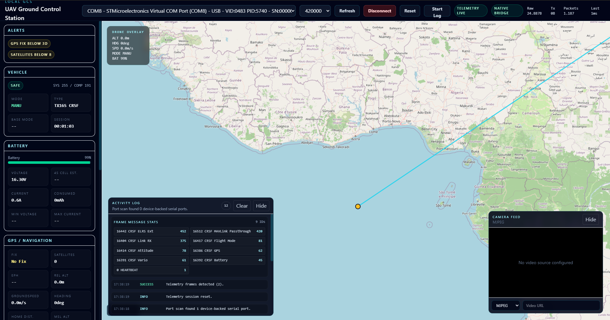

# UAV Ground Control Station


A local ground control station for UAVs — map, telemetry, and serial link in one dashboard.


---

## Overview

**UAV Ground Control Station** is a slim, locally operated GCS that runs on the operator’s machine. A shared React UI shows position, battery, radio link, flight mode, and session stats on a MapLibre map — whether data arrives over **CRSF**, **MAVLink**, or both.

| Runtime | Use case | Protocols | Serial access |
|---------|----------|-----------|---------------|
| **Desktop** (Tauri, recommended) | Primary operator runtime, TX16S, Windows `COM*` | CRSF + MAVLink, GCS wake-up | Native Rust |
| **Browser + Node** | Development, MAVLink-direct links | MAVLink | `apps/server` (fallback) |

For **RadioMaster TX16S** with a USB telemetry mirror, the **desktop app** is the intended runtime (420000 baud, CRSF-first). See [`docs/adr/0001-dual-runtime-desktop-canonical.md`](docs/adr/0001-dual-runtime-desktop-canonical.md).

## Safety

This project is experimental ground-control software. Do not use it for unsafe, unsupervised, or illegal UAV operation. Always follow local regulations, manufacturer guidance, and safe test procedures.

Prefer bench testing and disconnected telemetry validation before using the software with real flight hardware.

## Features

- **Live map** with flight track (up to 5000 points), home reference, distance, and bottom-center **Attitude HUD** (pitch ladder, roll arc, heading tape, speed/altitude, climb bar, armed/mode)
- **Telemetry sidebar** — **Text** or **Inst** (mini gauges with the same telemetry fields as text mode); drag card headers (⠿) to reorder (shared order for both views, stored in `uav-gcs.sidebar.order`); **Reset** restores recommended flight-priority order; alerts stay fixed at the top
- **Serial link** — port picker (USB/PNP preferred), manual path entry, common baud rates
- **Activity log** — connection status, parser stats, frame message stats
- **Optional video stream** (MJPEG, etc.) via environment variables
- **Session logging** and reset for new flights
- **Replay & Simulation** — frontend-only, read-only telemetry sources that drive the same dashboard without hardware: replay recorded `.jsonl`/`.json` logs (start/pause/seek/step, speed and timing modes) or run deterministic seeded simulations. See [`docs/replay-mode.md`](docs/replay-mode.md) and [`docs/adr/0003-frontend-only-replay-simulation.md`](docs/adr/0003-frontend-only-replay-simulation.md)
- **Shared data model** [`TelemetryState`](packages/shared/src/index.ts) for desktop and browser

## Screenshots



Desktop runtime: map, telemetry sidebar, frame message stats, and optional camera panel.

## Architecture

**Telemetry data flow:**

```text
TX16S / Flight Controller
        |
        | USB serial telemetry
        v
Desktop / Node parser
        |
        | normalized TelemetryState
        v
React operator dashboard
```

**Monorepo layout:**

```text
packages/shared     Shared types & TelemetryState
apps/web            React + Vite + Tailwind + MapLibre (shared UI)
apps/desktop        Tauri v2 + Rust (CRSF/MAVLink, COM*, wake-up)  ← canonical
apps/server         Fastify + WebSocket + serialport (MAVLink, dev/fallback)
```

Domain language and terms: [`CONTEXT.md`](CONTEXT.md).

## Prerequisites

- **Node.js** ≥ 20.19
- **pnpm** 10.x (`corepack enable` recommended)
- **Desktop build:** [Rust](https://www.rust-lang.org/tools/install) **≥ 1.85** (stable; `rustup update stable`) and [Tauri v2 prerequisites](https://v2.tauri.app/start/prerequisites/). Older Cargo versions fail on `Cargo.lock` v4 and current crate dependencies — see [`apps/desktop/src-tauri/rust-toolchain.toml`](apps/desktop/src-tauri/rust-toolchain.toml).
- **Windows:** run maintenance commands (`pnpm install`, `lint`, `typecheck`) in **WSL**; run **Tauri dev/build** for real `COM*` hardware in **Windows PowerShell**

## Quick start

### Repository

```bash
git clone https://github.com/gitfeber/UAVGroundControlStation.git
cd UAVGroundControlStation
pnpm install
```

### Desktop (recommended)

**Pre-built installers** (no local Rust toolchain required):

1. Open [GitHub Releases](https://github.com/gitfeber/UAVGroundControlStation/releases) for this repository.
2. Download the asset for your OS (Windows `.msi` / setup `.exe`, or Linux `.deb` / `.AppImage`).
3. Install and launch **UAV Ground Control Station**.

Each push to `main` runs tests first; if they pass, CI publishes a **preview prerelease** with Windows and Linux installers (tag like `v0.2.1-build.42`, job `publish` in [`.github/workflows/ci.yml`](.github/workflows/ci.yml)). **Stable** releases use a version tag such as `v0.2.1` (see [`.github/workflows/release.yml`](.github/workflows/release.yml) and the [release process](#release-process) below).

**From source:**

```bash
pnpm dev:desktop
```

Release build (local MSI/installer):

```bash
pnpm build:desktop
```

Artifacts: `apps/desktop/src-tauri/target/release/bundle/`

**Maintainers — stable release (optional):**

Automatic preview prereleases happen on every green `main` push. For a non-prerelease “stable” release:

```bash
git tag v0.2.1
git push origin v0.2.1
```

The release workflow builds **Windows** and **Linux** installers and attaches them to the GitHub release (no macOS builds in CI). You can also trigger it manually under **Actions → Release → Run workflow**.

If the release job fails with *Resource not accessible by integration*, enable **Settings → Actions → General → Workflow permissions → Read and write permissions** for the repository.

### Browser development (MAVLink fallback)

```bash
cp .env.example .env
pnpm dev
```

- Backend: `http://localhost:3001`
- Frontend: `http://localhost:5173`

## Operator notes

### Serial link

| Scenario | Typical baud rate |
|----------|-------------------|
| TX16S telemetry mirror (CRSF-first) | **420000** |
| Flight controller USB (MAVLink direct) | **115200** or **460800** |

**Symptom:** status shows “Serial linked” but no map/telemetry → usually wrong baud rate or wrong runtime (for TX16S, use desktop).

### Windows

Host `COM*` ports are often unreachable from **WSL-hosted Node**. For TX16S and CRSF, use the **desktop app**, not the browser stack over WSL.

### Supported port paths

- Windows: `COM*`
- macOS: `/dev/cu.*`, `/dev/tty.*`
- Linux: `/dev/ttyACM*`, `/dev/ttyUSB*`

Empty system ports without device metadata are hidden; unusual paths can be entered manually.

### Ground target terrain model (desktop)

Real elevation for **ground target estimation** is desktop-only (see [`docs/adr/0005-target-estimation-ts-rust-split.md`](docs/adr/0005-target-estimation-ts-rust-split.md)). Use **Browse…** in the Ground Target card to pick a local GeoTIFF/DGM, or paste a path manually; the Rust backend keeps a sliding **4 km × 4 km** window around the UAV and serves batched elevation queries for ray marching. **EPSG:25832** (ETRS89 / UTM 32N) projected GeoTIFFs — including common 1 m DGM-class tiles — are sampled in projected meters; WGS84 UAV coordinates are transformed before lookup. Geographic **EPSG:4326** GeoTIFFs continue to use lat/lon sampling.

**CRS detection:** the desktop DEM loader prefers GeoTIFF **GeoKey** EPSG tags (`projected_type` / `geographic_type` via the `geotiff` 0.1 reader). When those tags are missing, it falls back to model-extent heuristics for EPSG:25832 / UTM32 and WGS84 geographic tiles. Unsupported CRS values fail at load time with a clear error instead of sampling with the wrong axis order.

#### Projected DEM smoke test (desktop operator)

Use a **small GeoTIFF clipped around your flight area** (full-state tiles are large and slow to window-cache).

1. Start the desktop app with live telemetry over the flight area.
2. **No DEM loaded** — Ground Target estimate should be **bad** with `dem_not_loaded`; map marker/LOS hidden.
3. **Browse…** or paste a DEM path in the Ground Target card, then confirm metadata loads.
4. **Metadata check** — expect **EPSG:25832** (ETRS89 / UTM zone 32N) for projected tiles, resolution about **1 m** for DGM-class data, and a plausible source path.
5. **Valid/warn estimate** — orange map marker and dashed LOS appear when gimbal/GPS gates pass.
6. **Bad estimate** — marker/LOS hidden; inspect reasons in the Ground Target card.
7. If **every** sample is `dem_out_of_coverage`, the tile CRS is likely wrong, the UAV is outside the GeoTIFF extent, or the file is not EPSG:25832 / UTM32. `dem_nodata` means the raster cell is empty/NoData inside coverage.
8. Calibration, terrain path, and sample-log JSON/CSV export should persist across reload (`localStorage` + in-memory log). Desktop **Save JSON…** / **Save CSV…** use native file dialogs.

| Tauri command | Purpose |
|---------------|---------|
| `load_terrain_model` | Open a local GeoTIFF path; returns terrain metadata |
| `get_terrain_metadata` | Current terrain model metadata / loaded flag |
| `clear_terrain_model` | Unload the active terrain model |
| `sample_terrain_amsl_at` | AMSL sample at a lat/lon (anchor-aware window cache) |
| `get_elevation_at_enu` | ENU elevation relative to estimate anchor |
| `get_elevations_along_ray` | Batched samples for target-estimation ray marching |
| `save_target_log` | Write exported target sample log JSON/CSV to a host path |

Frontend wrapper: [`apps/web/src/lib/tauriDemTerrain.ts`](apps/web/src/lib/tauriDemTerrain.ts) (`TauriDemTerrainProvider`). Browser dev continues to use synthetic terrain only.

### Ground target estimation (live)

Ground target estimation (image center) runs in **live** mode only. Use the sortable **Ground Target** sidebar card for full readout and settings (`localStorage` keys `uav-gcs.target.*`, including video latency, altitude mode/offset, gimbal calibration offsets, raycast range/step/min-down-angle, and stale-telemetry threshold). The camera panel shows a crosshair plus compact lat/lon, slant range, and quality. Valid or warn estimates also draw an orange map marker and dashed line-of-sight from the UAV; **bad** estimates hide the marker/LOS. Desktop requires a loaded DEM — missing terrain surfaces `dem_not_loaded` instead of silently using flat terrain. Browser dev uses synthetic flat terrain only. The sidebar also keeps an in-memory **target sample log** (600 samples) with manual JSON/CSV export; desktop can save to disk via native file dialogs (`save_target_log`).

On the **desktop** link, gimbal attitude for estimation comes from MAVLink **285** (`GIMBAL_DEVICE_ATTITUDE_STATUS`, preferred) or compact legacy **265** euler payloads (skipped when the frame is large enough to be standard `MOUNT_ORIENTATION`). Vehicle **ATTITUDE** remains the body-fixed fallback in TypeScript when no gimbal message is present. Pose-related frames also populate `sampledAtMs` for ring-buffer alignment; check the activity panel for `GIMBAL_DEVICE_ATTITUDE_STATUS` / `GIMBAL_LEGACY` frame counts.

## Configuration (browser stack)

`.env` at the repository root (see [`.env.example`](.env.example)):

| Variable | Description |
|----------|-------------|
| `VITE_API_BASE_URL` | Node server REST API (default: `http://localhost:3001`) |
| `VITE_WS_URL` | WebSocket for telemetry (default: `ws://localhost:3001/ws`) |
| `VITE_MAP_STYLE_URL` | Optional: full MapLibre style URL |
| `VITE_SATELLITE_TILE_URL` | Optional: raster satellite tile URL |
| `VITE_VIDEO_URL` / `VITE_VIDEO_KIND` | Optional: camera stream (e.g. MJPEG) |
| `VITE_ENABLE_SPLASH_SCREEN` | Startup HUD splash overlay (default: enabled; set `false` to skip) |

Server: `PORT` (default `3001`), `HOST` (default `127.0.0.1`) in `apps/server`. The server exposes **unauthenticated** serial-control endpoints; it binds loopback only. Setting `HOST` to a routable address (e.g. `0.0.0.0`) is a deliberate opt-in that lets any device on the network open or close the link to flight hardware — see [`docs/adr/0002-server-loopback-only.md`](docs/adr/0002-server-loopback-only.md).

## Development

```bash
pnpm lint
pnpm typecheck
pnpm build          # browser stack
pnpm build:desktop  # desktop installer
```

If you open the repository root in VS Code, rust-analyzer is configured via [.vscode/settings.json](.vscode/settings.json) to use the Tauri crate at [apps/desktop/src-tauri/Cargo.toml](apps/desktop/src-tauri/Cargo.toml).

Agent and architecture rules: [`AGENTS.md`](AGENTS.md).

## Release process

Three workflows split the responsibilities, so it is always clear what publishes a release and what does not:

| Workflow | Trigger | Publishes? |
|----------|---------|------------|
| [`branch-checks.yml`](.github/workflows/branch-checks.yml) | Pull requests | No — validation only (typecheck, lint, tests, build) |
| [`ci.yml`](.github/workflows/ci.yml) | Push to `main`/`master` | **Preview prerelease** (tag `v<version>-build.<run>`) after tests pass |
| [`release.yml`](.github/workflows/release.yml) | Pushed `v*` tag or manual dispatch | **Stable release** (`prerelease: false`) |

In short:

- **Pull requests** run `branch-checks.yml` and never publish.
- **Merges to `main`** automatically create a **preview prerelease** with Windows and Linux installers, clearly marked as an automated build.
- **Stable releases** are created by pushing a semantic version tag:

  ```bash
  git tag v0.2.1
  git push origin v0.2.1
  ```

You can also start the stable **Release** workflow manually from the GitHub **Actions** tab (**Actions → Release → Run workflow**).

Both `ci.yml` and `release.yml` set `generateReleaseNotes: true`, so GitHub appends auto-generated notes grouped by the categories defined in [`.github/release.yml`](.github/release.yml) (Features, Fixes, Documentation, Maintenance, Dependencies, Other Changes).

## Project structure

```text
apps/desktop/       Tauri + Rust (primary serial link)
apps/server/        Node backend (dev/fallback)
apps/web/           React dashboard
packages/shared/    API and telemetry contracts
docs/adr/           architecture decisions
```

## License

Copyright © 2026 F. Eber

Licensed under the [GNU General Public License v3.0](LICENSE) (GPL-3.0-only). You may use, modify, and redistribute this software under those terms. If you distribute a modified version, you must release the corresponding source under the same license. See [LICENSE](./LICENSE) for the full text.
